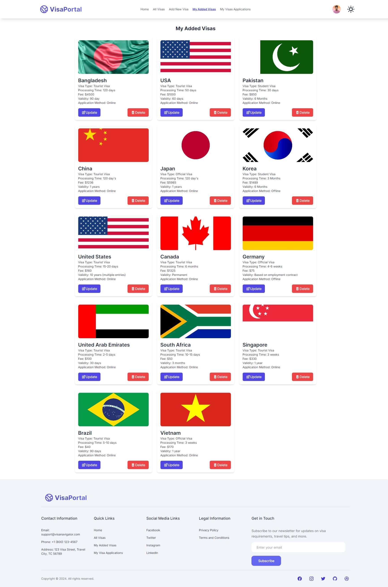

## Visa Navigator Portal Sunflower Frontend

## Assignment Category: Sunflower

### Project - Batch 10 Assignment 10

This is a React application that uses the Sunflower API to fetch data and display it in a user-friendly way.

## Description

The application is built using React and the Sunflower API. It fetches data from the API and displays it in a user-friendly way. The application has a header, footer, and a banner section. The banner section displays a carousel of images and a call-to-action button. The footer section displays links to social media platforms and contact information. The header section displays the logo and a hamburger menu.

## Live Demo

- Frontend:
  [https://visa-navigator-portal.web.app](https://visa-navigator-portal.web.app)
- Backend:
  [https://sunflower-bankend-api.vercel.app/visas](https://sunflower-bankend-api.vercel.app/visas)

## Features

- Fetches data from the Sunflower API
- Displays data in a user-friendly way
- Includes a header, footer, and a banner section
- Displays images in a carousel
- Displays links to social media platforms and contact information
- Displays a call-to-action button

## Packages Used

- React
- React Router DOM
- React Helmet
- React Loader Spinner
- React Simple Typewriter
- React Toastify
- React Icons
- React Tooltip
- Sweet Alert
- React hook form

## Screenshots

Name: Md. Ranju

Github: https://github.com/muhammadranju
