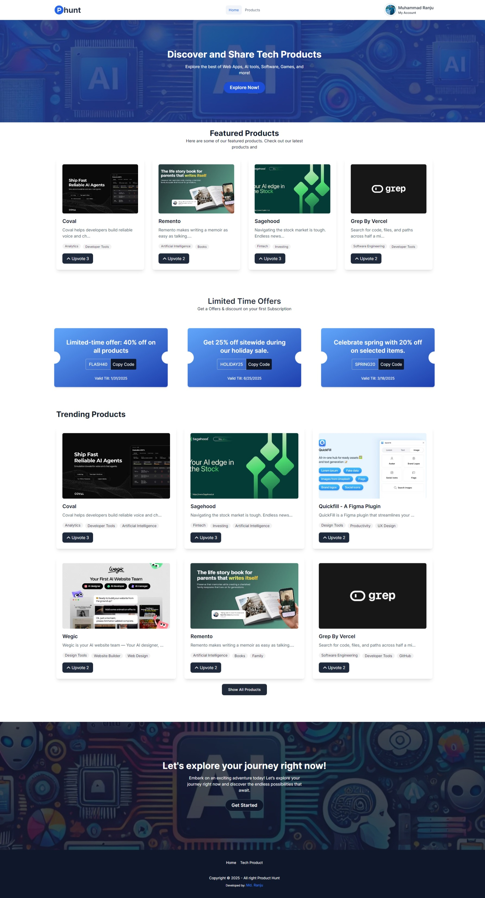
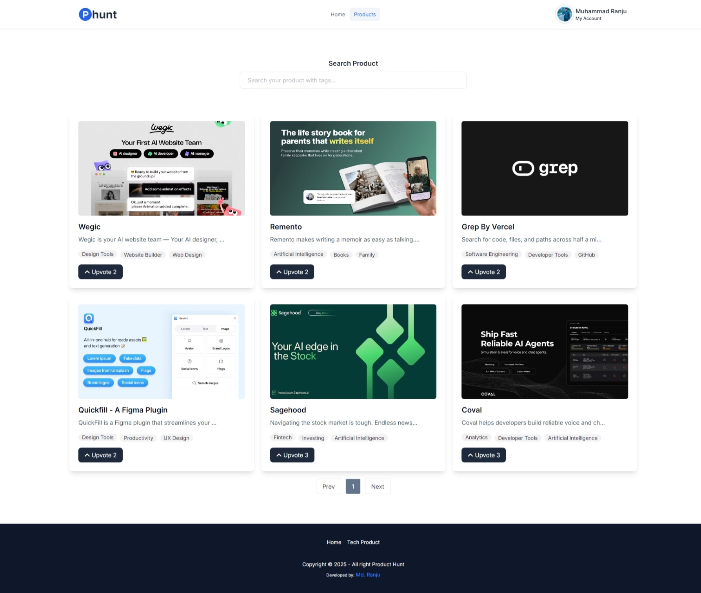
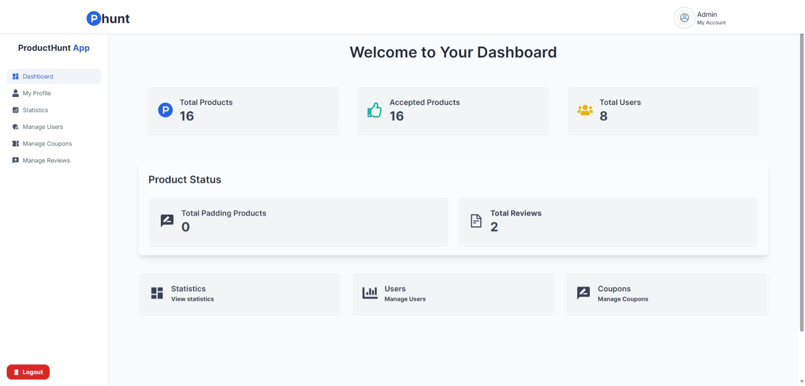
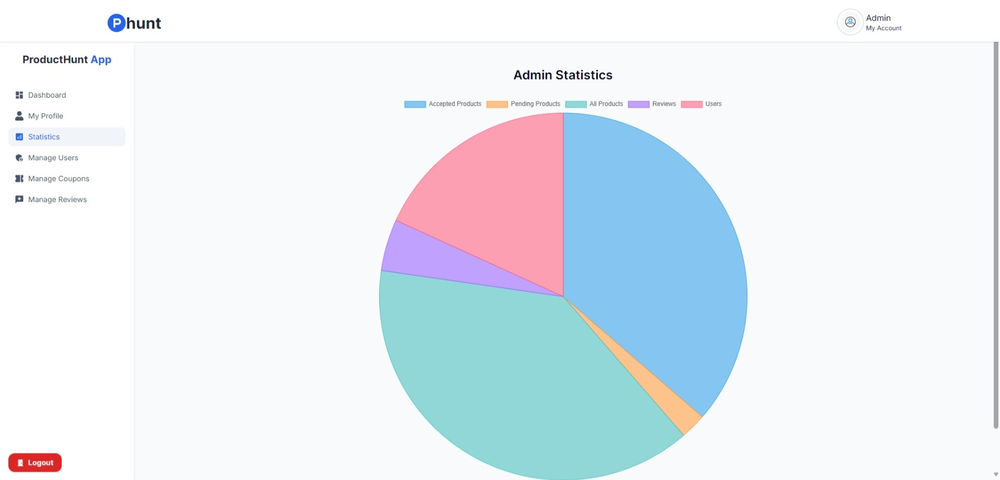

## Project Name: Product Hunt Backend

### Category: Assignment Category - 15

### Admin Information:

- Name: Admin
- Email: admin@gmail.com
- Password: Admin123

## Website Links:

- Frontend: https://product-huntapp.web.app
- Backend: https://product-hunt-backend.vercel.app

## Description:

This project is a backend application for a Product Hunt API. It allows users to create, update, and delete products, coupons, users, and reviews. It also provides a user authentication system and role-based access control.

## Features:

- User authentication and authorization
- Product listing and details view
- Upvoting and commenting on products
- Search functionality
- Responsive design for mobile and desktop
- Admin can see all user and make them as Admin Moderator
- Admin can create coupons
- Admin can delete coupons
- Admin can update coupons

## Technologies:

- JavaScript
- Node.js
- Express.js
- MongoDB

## Purpose:

- This project is a backend application for a Product Hunt API.
- It allows users to create, update, and delete products, coupons, users, and reviews.
- It also provides a user authentication system and role-based access control.

## Packages Used:

- **Node.js**: A JavaScript runtime built on Chrome's V8 JavaScript engine.
- **Express.js**: A fast, unopinionated, minimalist web framework for Node.js.
- **MongoDB**: A NoSQL database that stores data in JSON-like documents with dynamic schemas.
- **Mongoose**: An ODM (Object Data Modeling) library for Node.js that simplifies database interactions.
- **JWT**: A JSON Web Token (JWT) is a compact URL-safe means of representing claims to be transferred between two parties.
- **Cookies**: A small, simple, and easy-to-use session middleware for Node.js.
- **Slugify**: A Node.js library for generating slugs from strings.

## Screenshots:

Admin email: admin@gmail.com
Admin password: Admin123

Front-end Live Site Link: https://product-huntapp.web.app
Back-end Live Site Link: https://product-hunt-backend.vercel.app

Client Side Github Repository Link: https://github.com/Programming-Hero-Web-Course4/b10a12-client-side-muhammadranju
Server Side Github Repository Link: https://github.com/Programming-Hero-Web-Course4/b10a12-server-side-muhammadranju
